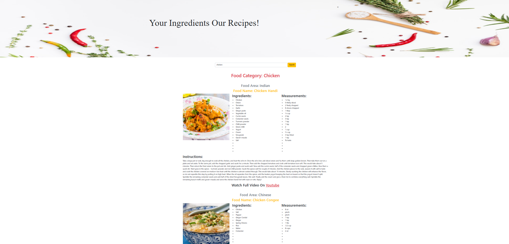

# 🍽️ The Foodie

Welcome to the **Food Recipe Finder** project! This web application allows users to discover a variety of food recipes with just a click. Whether you're looking for a quick meal or an elaborate dish, this app makes it easy to find delicious recipes based on your ingredients.

## 🌟 Features

- **User-Friendly Interface**: Simple and intuitive design for easy navigation.
- **Responsive Design**: Works seamlessly on all devices, including laptops, tablets, and mobile phones.
- **Real-Time Recipe Search**: Quickly find recipes by entering your desired meal in the search bar.
- **Detailed Recipe Information**: Get comprehensive details including ingredients, measurements, instructions, and even video tutorials.

## 🚀 Technologies Used

- **HTML**: For structuring the content.
- **CSS**: For styling the application and making it visually appealing.
- **JavaScript**: For adding interactivity and fetching data from the MealDB API.
- **Bootstrap**: To ensure a responsive layout and design.

## 📚 Getting Started

To get a local copy up and running, follow these steps:

1. **Clone the repository**:
   ```bash
   git clone https://github.com/Deepakjd-dev/The-Foodie.git
   ```
2. **Navigate to the project directory**:
   ```bash
   cd The-Foodie
   ```
3. **Open `index.html` in your web browser** to view the application.

## 📸 Screenshots



## 🛠️ Usage

1. Open the application in your browser.
2. Enter the name of the meal you’re interested in.
3. Click the **Search** button.
4. Browse through the results and enjoy cooking!

## ⚙️ Future Enhancements

- Add user authentication for saving favorite recipes.
- Implement a meal planner feature.
- Expand the recipe database with more cuisines and dietary options.

## 🤝 Contributing

Contributions are welcome! Please feel free to submit a pull request or raise an issue.

## 📄 License

This project is licensed under the MIT License - see the [LICENSE](LICENSE) file for details.

## 📁 File Structure

```plaintext
.
├── assets/
│   ├── css/
│   │   └── style.css        # Styling for the project
│   ├── images/              # Images used across the portfolio
│   ├── js/                  
│   │   └── app.js           #  JavaScript for the project
│   └── fonts/               # Custom fonts used in the design
├── index.html               # Main HTML file
└── README.md                # Project documentation
```

## 📞 Contact

For any questions, feel free to reach out:

- **Email**: deepakjd.dev@gmail.com
- **GitHub**: [Deepakjd-dev](https://github.com/Deepakjd-dev)

---

Thank you for checking out the Food Recipe Finder! Happy cooking! 🍳
